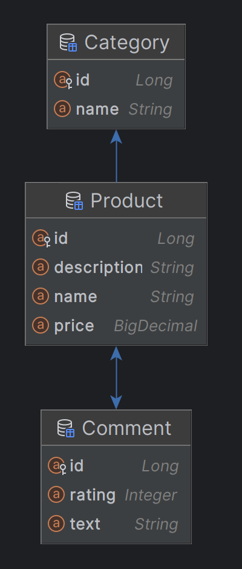

# Supplier Consumer

## Назначение проекта
Проект служит для демонстрации работы с RestTemplate и состоит из двух микросервисов: 
 - `Supplier Service` 
 - `Consumer Service`

## Стек
- `Spring Boot`
- `Spring Data Jpa`
- `PostgreSQL`
- `QueryDSL`
- `Swagger`
- `Docker Compose`

### Supplier Service
Сервис предоставляет api для работы с сущностями `Category`, `Product`, `Comment`.
Позволяет выполнять базовые `CRUD` операции в `PostgreSQL`, а так же нахождение среднего итогового рейтинга
у сущности `Product`, который формируется по оценкам оставленным в комментариях.
При удалении сущности, все связанные с ней сущности ниже по иерархии - удаляются.

### Структура базы данных:



### Consumer Service
Сервис не имеет собственной базы данных и посредством `RestTemplate` обращается к api 
сервиса `Supplier Service`.
По умолчанию по адресу  `http://localhost:8081/swagger-ui.html` доступна документация. 

### Запуск

Запустить: 
```
docker-compose up
```
Порты занимаемые по умолчанию:
- 8080
- 8081
- 5432

